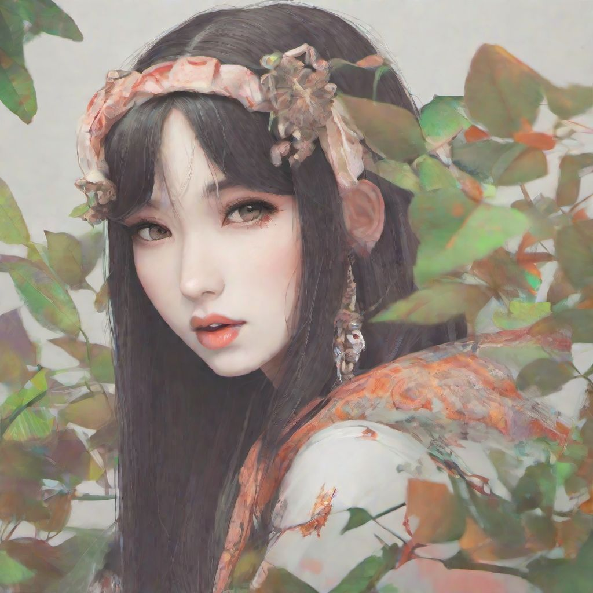

# Regularization Images - SDXL - `1girl` Class

Stable Diffusion XL training regularization images. Used during LoRA training to reinforce the underlying model and
reduce overfitting.

|             |                                                                                                   |
|-------------|---------------------------------------------------------------------------------------------------|
| Model       | [`stable-diffusion-xl-base-1.0`](https://huggingface.co/stabilityai/stable-diffusion-xl-base-1.0) |
| Class Tag   | `1girl`                                                                                           |
| Tags        | Booru - WD1.4 `*.txt`                                                                             |
| Cardinality | 2020 images                                                                                       |
| VAE         | None                                                                                              |
| Sampler     | DDIM                                                                                              |
| Steps       | 20                                                                                                |

Useful if you're using booru-style tags while training against the SDXL base model. While it isn't specialized
on booru-style tagging, it still works effectively.

## Usage

In the Kohya_SS GUI, select this project directory as the `Regularisation folder` during training.

**Note**: Only use these regularization images if training against the `stable-diffusion-xl-base-1.0` model. Training
with regularization images from a different model will heavily bake that style into the result.
